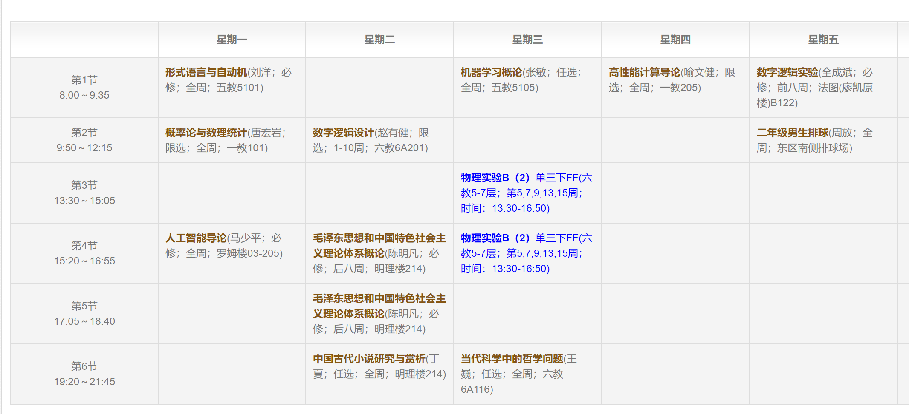

# 总括
本学期是特殊的一学期，也同样是卓有收获的一学期。
在家的学习并没有让我产生懈怠，经过短暂的适应和调整，我很快就进入了学习状态。
本学期课程多、难度大，除了在学习上投入较多精力之外，我还在社工方面花了一定的时间，
即在校团委组织制度组和系团委组织口做社工。
在科研上，我继续在跟王晨阳辅导员和戴傲初一起做素质教育的一个项目。
在家庭方面，本学期陪伴充足较为满意，感情方面已经回到单身状态。
在未来规划方面我也有了更多的思考，下面我将详细谈一谈。

# 学习
从学习上讲，本学期选的课稍多了一些，并且难度也较大。不过我较为顺利地坚持下来完成了本学期的学习任务，
并取得了较为令自己满意的结果，
这让我很开心。

唐宏岩老师的概率论与数理统计课程难度较大，作业很多，但是老师讲授的很好，收获也是不小的，学完之后感觉到很充实。
数字逻辑设计这门课理论部分取消了考试，我们全力投入实验部分(基于光立方的音频可视化)。队友潘传宇和我经过合理的安排和充分的努力，
取得了较为满意的项目成果，不过这个过程也令我感受到硬件设计的不易。
机器学习概论课是大三下的一门课，因为上学期去到本课的开课教师张敏老师的实验室门下，因此想在这学期就提前修这门课。
这门课的内容较为基础，老师的讲授也非常清晰，作业安排也较为恰当，总体来说体验很好。令我印象很深的是，老师对学生的关注、对教学的认真。
高性能计算导论这门课程，内容非常多，有4次编程作业，每次作业分数占比也不小，而且难度也不小，这充分锻炼了我的编程能力和调试能力，
同时本课也给了我一定的并行编程意识，我在之后的编程中也用到了这种思想，总体来说还是收益的。

再说说遗憾吧。人工智能导论课程上，第二次大作业也就是四子棋博弈，我的完成情况不是特别理想。
经过尝试$\alpha-\beta$剪枝和UCT两种算法后，我的程序博弈能力仍然欠佳，但是这时我可能已经在这个作业上投入了20余小时，
精神状态也较为低迷。在这时我果断决定只基于现有版本做最简单的优化，尽快结束这个作业，并投入到新的工作中。
这样做的结果是，我很快就走出了情绪的低谷并回到了正常的工作状态。
但后果也是本次作业得分稍低了一些。后来在和邹恬圆小姐姐聊天时，她说对邓俊辉老师上学期
说的不应该给同学们设置一个唯一的目标拼命冲刺，有时候也需要一些选择，这又让我豁然开朗。
在当前的学习生活中，面临的抉择还不算多，也就是像这次比如作业分数和日常生活的抉择，又如我了解到的一些同学在
面试机会和学业之间也会做相应的权衡，这样的抉择意识应该建立。到了未来，有了家庭、有了事业、父母需要照顾，
在更丰富的场景下，抉择就更为重要了。

还有一些遗憾，例如"中国古代小说研究与赏析"这门课，我并没有怎么听，因为这门课只要求最后交一篇2000字论文，而且是自带PF的文核课，
再加上我在寒假和学期内也阅读了《西游记》和《红楼梦》两本中国古代小说，对这门课并没有很重视。
可是在最后一节课，老师说到这是他职业生涯最后一堂课时，我还是有些愧疚之前没有好好听。
此外，对于"当代科学哲学中的哲学问题"这门课，我也没有认真听，这是一门读写认证课，这是我当时想选它的直接原因。
这门课老师非常负责，讲解很清晰，但其实我也只是完成了最基本的作业，并没有深入学习。

总的来说，本学期学习比较努力，从过程和态度上来说较为满意，最终的成绩还是要等教务公布，并且还有两门要返校考试的课。

# 社工

社工这方面我想谈三点，分别是校团委组织制度组、系团委组织口和计8党支部。

校团委组织制度组是我第二次在校团委做社工，由上学期校团委团代会组辅导员毛俊松辅导员推荐前往。
这个组的工作可能由于本学期不在学校的原因，较为轻松，落在我身上的任务尤其少。

先谈谈收获吧，最大的收获我认为是从其他人的身上学习，正如孔子所说"择其善者而从之，其不善者而改之"。
"善者"有很多，这个组的辅导员王永赫学长令我印象非常深刻，他的讲话总是很有水平，不罗嗦、有内涵，对组员也是非常关注，
他在学期中时约每个组员和副组长都单独语音聊天，我和他的聊天也非常愉快和顺利。
不好的体验也是有的，首先来说我认为这个组这学期的工作并不多，存在一定的懈怠情绪。拿我所在的联系院系工作来说，
每周都会做组织副书记微沙龙，我们会做会议纪要，此外还需要对多次会议纪要做调研参考，总结组织副书记提出的建议和问题，便于校团委进一步开展工作。
但其实直到期末我们一直都没有做这个事情。我不是说归咎于谁，而是说一个组织要把好的制度坚持下来，把事情做到位，而不是像这样不了了之，最后说起来就很难受了。

此外我还感受到一种待人的礼仪，温柔真的是人间宝藏。在16周的组织副书记例会上，本来论我做签到、做会议纪要并录音，
但我第二天早上恰好有高性能计算导论的考试，于是我向负责此事的副组长请假，她表示充分理解，但她说也希望我帮忙做一下签到，等她当晚考完后
由她做会议纪要，并且反复鼓励我祝我第二天考试顺利、早点休息。我心里感到非常温暖，立志以后待人接物也要这样温柔善良、体会和理解别人。
但当在做会议签到时，由于会议系统的一些问题，签到变得困难了一些，一位学长屡次找我要签到表说要催没来的副书记来开会，但是我当时也是第一次做签到，线上也存在一些困难，
我自己操作也不太熟练，拖了一阵子才弄好，但这样不停地催令人很难受体验很差。但经过后来的了解，这个签到表只是在会议开始时有很大作用，用来提醒没有来的同学，
我做的太慢的确就意义不大了。这也告诉我，在工作时，要充分了解对方的需求，根据需求做事，而不是盲目地按照自己的那套来。

在系团委组织口来看，本学期任务也不算特别多。先说说问题吧，我感觉一个社工组织还是应该更紧密一些，而不是过于松散和随意，尤其是在组织这样较为严密的工作上。
此外我认为，组织口的干事是一个很尴尬的地位。他们负责联络大约4-5个班级的支书，但一般来说只是一个传话筒的作用，即把组织副书记安排的任务组织语言重复给支书，并且经常要催支书交一些文件。
但干事们对支书的工作并不是非常了解，对自己要催缴的文件也不是很懂，这就造成一种工作中潜在的糊涂和尴尬。此外由于对团工作规章制度的不熟悉，支书提问他们时，他们也很难回答，只能再向组织副书记转达问题。
我认为应该对组织口干事进行一定的培训，例如学习支书要做的文件，以便更清晰地帮助各班开展团工作。
本学期较大的一件事情就是做甲级团支部评比，在甲团评比时，通过审材料我认识到，当一个想考察你的人只能通过材料了解你时，这份材料有多么重要。
从排版的整洁、措辞的严密、配图的美观、层次和重点突出，各个方面都应该注意到。一份美观、严谨、清晰的材料能够给我留下非常深刻的印象，这也是对我自己的一个
提醒。

总的来说，我对团工作还是有一定的兴趣的，希望每学期都能做一些社工，锻炼自己与人交往能力和处理事情的能力。

从党支部这方面来说，本学期主要是准备了预备党员的思想分享。上学期通知每个预备党员要做40min的一个分享，
我做的内容是“从《共产党宣言》看中国发展道路”的分享。《共产党宣言》是我在上学期马原论文时拜读和研究的，因此准备起来没有特别困难。
此外，我也认识到，党的工作应该是严谨求实的，而且常常具有一定的严肃性。

# 科研
科研这方面，我主要想从实验室项目和我牵头组织的"西瓜读书小组"这两方面谈谈。

本学期在寒假时，集中学习了深度学习的入门知识，例如MLP, CNN, RNN等，并进行了一些实现的尝试。
这样的自主学习对提升我的能力是有很大帮助的，也为人智导课程的作业提供了很多经验。
但其实本学期在科研上投入仍然没有达到我满意的水平，我认为主要原因还是自己课比较多课业压力大，同时也没有真正把科研事情放在
非常高的优先级，这一点在后续应该有一定的改进。本学期其实也就是主要做了一些数据的整理，以便得出初步的研究方向。
其实我认为这项工作还是蛮有意义的，通过计算机技术，为中学的教育助力，做的好的话也是一个非常值得发展的方向。
总之，这个暑假要在科研上下非常大的功夫，把这个项目做的好一些，对得起自己的努力，也希望能够在实验室这边站住脚跟。

再谈谈西瓜读书小组吧，这个小组主要由5-6个同学组成，轮流分享周志华老师《机器学习》一书的内容。
说句实话我非常喜欢组织这样的活动，一方面是我在这个过程中的确收获很多，每次我负责的内容，我都会非常仔细地准备，
有时会在Google上花很多的时间理解内容并做PPT，力求给同学们讲清楚。在这个过程中，我增强了自学能力、学到了知识，也增强了知识的查找能力和表达能力。
我喜欢这个小组的另一个原因是，我很喜欢组织活动。从一个角度来看这能够认识和熟悉更多优秀的同学，另一方面来看我很自信能够组织好
一个小团队，在组织的过程中，我也能够把以前在社工上学习到的各种与人交流的技能实践进来。
例如在每次分享后，都要安排下一周做分享的同学，我一般会提前和下周分享的同学打好招呼，了解他们是不是很忙，需不需要找其他同学顶替，
这样既可以保证整个组织的正常运转，同时也是对组内同学的一种充分关心和理解。还有例如，每到周中，我也会提醒组里的同学记得阅读
本章的内容，以便周末进行交流，我也会找负责本章的同学了解准备的进度，关注他们是否遇到什么困难。

最后，我认为想要带动好一个组织，leader一定要有下面两种能力，一是业务能力，二是情感能力。
业务能力是指，在当前组织负责的领域，leader的水平首先是过硬的，这样才能服众。例如在西班牙实践支队中，
我们面临的第一个挑战就是办签证，我作为队长首先投入了很多精力，探明了办签证需要的流程和手续等等，并详细而清晰地告知了支队的成员。
我们支队的签证进度也是遥遥领先于系里其他海外实践支队的，这就是一种业务能力上的服众。又如在西瓜读书小组中，每次我负责的部分我都会非常认真地准备。
试想一个组织的Leader都对共同的事业不上心，其他的组内成员又怎么会能积极投入呢？再谈谈情感能力，即如何在情感层面，带动和团结好一个组织。
感情建设也是一个组织中非常关键的内容，我对这个问题的心得是，一定要关注团队中每个成员的感受，不要忽略任何一个人。
比如投票选时间，大部分人在某个时间可以，小部分人不行，决定选择这个时间时，可以和不行的小部分同学私信联系，关心原因，
让他们感觉到他们的参与同样重要。又如在聊天过程中，也不要总是以自己的处境和状态，推断别人的处境和状态，这样的做法是非常不合适并且引人反感的。
这部分内容离科研可能稍远，但却是我在两年的社工和与人相处、做组员和team leader时总结的一些经验。

# 家庭/感情

之前的学期总结总会有感情这单独的一部分，但是由于这学期已经回到单身了，经过一定的反思，我认为家庭
越来越需要的我的关注，这部分会在之后变为家庭。

还是先说感情吧。在2020年4月2日，我与女朋友结束了自2018年7月19日以来的关系，回归到了单身的状态。
同样在此我不想留下很多的怨念，而是着重反思问题。首先我非常遗憾的是，在大一到大二这段时间
由于较为投入感情，忽视了家庭，也就是对爸妈的关心不太够，这令我痛定思痛，此外由于之前有女朋友，自己对
未来的感情规划也没有仔细思考过，回到单身后我希望能够更理性地规划之后的感情和人生大事等等。

说说感情里的问题吧。我认为最大的问题是沟通问题。从始至终，我认为我和她的沟通都非常缺乏。一方面是我自己神经较为愚钝，不能敏锐地捕捉到对方的
细小而微妙的感情变化。另一方面她也是比较自闭的性格，不愿意或者不信任让其他人知道自己的真实想法。
从我自己的问题来看，我对于事业是非常用心的，这在一定程度上导致了感情可能会有些忽视。在学期初经过辅导员的谈话，我对感情问题有了更认真和严肃的认识，
但这样的改变可能也已经有些晚了。在后续的反思过程中，我的确认为自己对感情的投入在后期变少了，逐渐被学习、科研、社工等事情挤占。
每当看到电影中的男主既注重事业，也顾家的时候，我都会提醒自己应该把事业和家庭都放在非常重要的位置上。甚至我现在有一些心理包袱，如果不能
很好地平衡事业和爱情，这对女生是一件很不负责任的事情，我作为男生决不能做出这样的事情。但其实我是对感情非常认真的一个人，我希望自己能够继续保持这样认真的态度，
不要丧失对爱情的信心(怎么会呢...)

从家庭来看，家庭的确是值得我更加投入的。妈妈的身体不太好，她去住院的那一周，我学会了自己做饭、收拾家，也更加意识到了自己在今后需要承担更多家庭的责任，照顾父母。

# 未来规划
之后要把科研任务放在更重要的位置上，争取做出一些结果。
同时继续保持自己对未来的期待，包括职业生涯、感情计划、长远的眼光等等。

我其实还发掘到到自己的优点——适合做Leader. 一方面是我锻炼的多，另一方面我很自信。
这个特点我感觉在其他计算机系同学中较为少有，是一个可以继续发扬的优点。

其他优点：正直、善良、自信、认真、靠谱、勤奋、自律。
缺点：有时候不太能够理解到别人的情感，易急躁，有时候会粗心

体制内外？创业/创业公司？实习？

# 杂项
这学期运动还是比较充足的，跑步非常多，每周平均2-4次。同时也加强了俯卧撑，加强了上肢力量。
体重从57kg涨到了60kg，我可能也不太想继续变胖了哈哈。

这学期在家买了一个旧琴，把曾经会的一些曲子捡了起来，现在可能随手能拉至少5首曲子了。

# 结语

总之本学期很充实，为未来的进一步发展打下了坚实的基础。
继续坚持下去！

