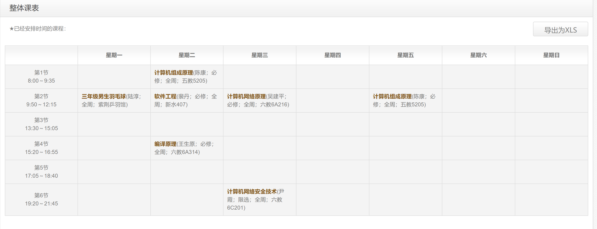
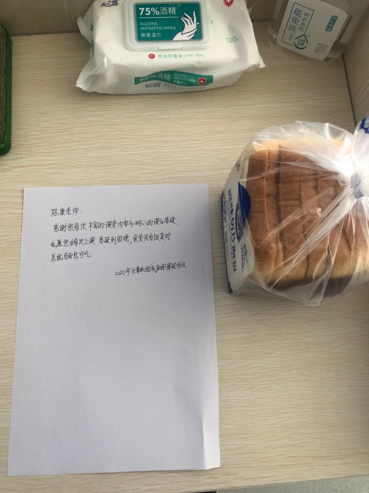
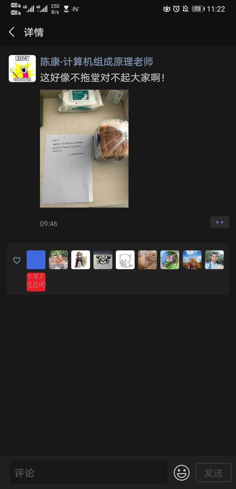
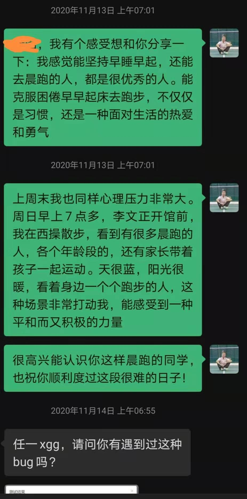

# 总览

本学期是拼搏的一学期，是像小陀螺一样转的一学期，虽然也有迷茫和困顿，但又永葆前进的动力！本次学期总计将从学习、科研、社工、实践、感情、未来规划、获奖、做真诚善良又闪闪发光的人等方面谈谈。

# 学习

本学期选课很少，主要是考虑到各个课程压力都比较大。一共选了5门课，共14学分，下面分别谈谈我对这几门课的感受。

## 计算机组成原理

本课的授课老师是刘卫东、陈康和陆游游老师。陈康老师是我的主要授课老师。

上完了这门课，我着实对计算机的系统结构有了更多的了解，例如CPU的设计、计算机的存储结构、计算机与外设的连接等等。本课最出名的也就是"奋战三星期，造台计算机"。这门课的造计算机指的是在FPGA开发板上，通过编写硬件语言Verilog，使得FPGA可以执行一些既定的指令。造计算机我遇到了很好的队友，潘传宇和黄嘉良，两个队友很努力也很有想法，最终我们很顺利地结束了造计算机的任务。

陈康老师则是一个给我印象深刻的老师。虽然他看起来很不羁，讲课很随便，但着实讲的很好，能够脱离PPT内容的限制，合理地讲述课程的各部分内容，以加深学生的理解。因为他讲得好，所以来听他课的同学也很多。同时，他也是一位对学生很负责的老师，在群里常常指导同学们，发布errata等等，可以看出他对教学很用心。

## 计算机网络原理

本课的授课老师是吴建平、徐明伟。吴建平是我的主要授课老师。

计算机网络，其实我感觉是一个很合理、很有趣的方向，*Computer Networks*这本书也写的很详细，但最令我难以接受的就是授课老师对这门课很不用心。

老师讲课，7分故事3分知识，很难在他的课堂上建立起对网络哪怕最基本的认识，这就说明在我看来这门课完全没有达到它设立的目的，就连最基本的概念，也是考自学而来，这真是令人难以接受。他的课我只缺了一次(去参加内蒙古籍清华学子座谈会)，但听完一学期后，仍然对网络的基本概念知之甚少，我很怀疑他对自己在讲什么、想要教给学生什么都不知道。

网络原理这门课期末复习起来也很困难，主要原因还是老师上课没有达到应有的目的，同时课程PPT也支离破碎，没有很好的逻辑性。此外，这门课没有很好的往年题作为参考，大多都是回忆版往年题，这给复习带来了更大的困难。于是我只能事无巨细地复习庞杂的网络各层，也很难把握住考试的重点。考的感觉也很一般，总之这门课体验很差。

不过造路由器难度并不大，但仍然是在没有对网络大概概念的情况下，直接上手做路由器，仍然存在诸多问题，这也是这门课程亟待改革的方面之一。

## 编译原理

本课的授课老师是王生原、姚海龙和陈渝老师。王生原老师是我的主要授课老师。

这门课一开始学起来还是很有难度的，难度主要集中在理解上(例如LR(1)分析)以及后续较为繁琐的技术(例如活跃数据流分析等)。不过整体来说，这门课程难度不太大，课程讲义和PPT也较为完善。从原理上的教学来看，这门课程还是比较成熟的。

王生原老师在我看来，是一位很和蔼、负责的老老师。他上课虽然声音不大，但是能让我感受到，他在尽力让学生听懂他在说什么(虽然还是有很多时候我并不能当堂听懂)。最后一节课，他还说，感谢常来的同学以及和我讨论问题的同学，这是一句很有趣又温暖的话。

这门课的实验，就是对一个C语言的子集，从头开发一个编译器。总的来说，本课的实验设计初衷是好的，让学生从实践的角度真的做一个编译器出来。但是实践起来，也有诸多问题。例如课程进度比实验安排的进度慢很多，导致做实验的时候还有不少的概念要自己理解和自学，对原理学习的帮助没有想象中的那么大。此外，有了助教的参考实现，我自己为了赶进度，也很大程度上借鉴了助教的实现，自己的思考坦率讲在后期很有限。

## 软件工程

本课的授课老师是裴丹、王建勇。裴丹老师是我的主要授课老师。

这门课是实践性很强的课，主要以大作业为导向。老师上课讲的内容，更多是软件开发的原则性和指导性的提议，并不是对我们自己大作业的要求，在我们这样一个课程大作业的容量下，也很难做到非常标准的软件开发流程。

软件工程这门课是我自己比较满意的一门课程了。潘传宇、邹恬圆、刘畅、戴傲初是小组成员，我作为队长，整个团队开发出了很好的项目，得到了老师和助教一致的认可。更多关于此项目的介绍，可以看我的Github仓库[CodeDancePedia](https://github.com/nmrenyi/CodeDancePedia). 这个团队的招募，在课程开始前的暑假就已经完成了。在大二的时候，我就在想之后会有机会拉起一个很棒的团队，做出很好的事情，软件工程就是这样的一个契机，经过很多的观察和相处，我找到了这四位队友，结果也证明，这个团队着实很好。

这次团队的合作，让我感受到了沟通和努力的重要性。在沟通方面，我们小组固定每周两次的见面时间，讨论项目推进的进展，做各种对接，在许多其他专业课的课上课下，我们也有很多的讨论，这让我们小组的沟通很及时，整个项目推进也非常顺利。在努力方面，我们在第一个开发周期(2周)就全部开发完成了项目的主体功能，例如前后端分别搭建，CI/CD环境配置，前后端通信等等，这也让我们组的开发进度非常快，为后续其他课程的学习留下了比较充足的余地。

从我自己来看，在小组队长的位置上，我再一次锻炼了自己作为团队带头人的能力。做领导者，在我看来还是两个词，业务能力和情感能力。业务能力上，要足够服众，自己的专业能力、沟通能力不能低，在资源、技术各方面给团队出力，在轻重缓急、时间安排策略安排等方面有独特的见解等等。情感能力上，要足够服人，这一点我也一直在努力，比如见面多送小礼物，平时多多关心等等。在本次开发的过程中，我也在某些时候对团队要求太高，引起了部分成员的不满，这也是我一直在反思的地方。

总的来说，本课的合作很愉快！

## 计算机网络安全技术

本课的授课老师是尹霞老师。

这门课讲了比较基础的密码学和网络安全技术，内容不难。尹霞老师在我看来是一位教学水平很高的老师，讲课非常清楚。在课间课后和老师交流讨论也很有趣。虽然这门课复习起来稍显枯燥，但也不是大问题，瑕不掩瑜。

## 三年级男生羽毛球

本课的授课老师是陆淳老师。

这门课上讲授了基础的正手发高远球，正手后场击高远球，基础的吊球、刹球、步伐、单双打等等。由于课时有限，本课涵盖内容也很受限制，练习时间也很受限制。

这门课上，我主要找回了之前打球的手感，进一步规范了自己的动作和技术，在打羽毛球中获得了更多的乐趣。

陆老师人也非常好，教学很细致耐心，对学生很负责。

# 科研

本学期科研投入仍然不多，主要的原因或许是课程压力比较大，抑或我自己重视程度还不够。

素质教育这个项目，终于收尾了。这个项目我自己很不满意，整个分析过程充满了模糊和瑕疵，最后的结果也不尽人意。这警醒着我之后做项目要做的尽心尽力，做好开局，不要做出豆腐渣工程。

新上手的ReChorus项目，才算真的是推荐系统的入门项目了。这个项目主要旨在在现有的框架下，实现更多模型。我感觉这是一个比较适合入门的项目，应该好好做。

# 社工

本学期社工，我只是在计算机系团委组织口做组长，没有在校一级的团委继续工作。

仍然是由于课程压力比较大，本学期社工也推了很多锅，说句实在话自己心里是过不去的。这学期我做的工作，主要是做了班团资源支持计划的发票报销，并没有做很多事情。下学期有系团代会和甲团评比等事项，自己要好好投入投入了。

# 实践

这学期的实践，主要集中在了结旧的实践和开展新的实践上。

旧的实践主要有两个，西班牙实践和江西实践，这两个实践我都是支队长，有一些报销相关的事务需要处理。

西班牙实践，这笔账很旧了，当时预付了一些机票和马德里酒店的钱，导致每个人亏空4000+的经费。东奔西走，收集各种票据，与负责报销的尹向荣老师各种沟通之后，我终于拿到了这笔报销经费，并且给队员分配下去了。虽然未能成行，但是有始有终，这是做事的一种态度。

江西实践，我在本学期主要是准备了各种材料和答辩，虽然由于宣传各方面不足，加之实践筹备也比较仓促，只是获得了系里的银奖和校级的铜奖，但同学们自己的收获才是最重要的。江西实践由于分工较为明确，负责报销的同学也对报销很熟悉，个人能力各方面很强，因此报销事务我并没有花很大的功夫。

新的实践筹备主要是去云南丽江的实践，这次实践我主动承担宣传负责人，因为之前我自己做实践的时候，宣传总是不太行。虽然本次实践又是因为疫情取消了，但是没准暑假还能去呢，期待！

# 感情

感情方面，继续单身。虽然有一些流言和八卦，但我并不是很在意。虽然曾经一度有冲动，但我也理性地克制住了自己。

希望自己能够找到一个，真诚热烈，又闪闪发光的女孩子。这样的女生，应该很容易分辨出来吧，有点像我自己。我相信会出现的。

# 未来规划

谈谈未来，自己希望留在当下的实验室直博。一个巨大的疑惑其实是，去年做的项目与这个实验室主要的方向好像并不相同，今年新上手的项目才算是入门吧，我自己对于这个方向坦率讲也不是非常了解，希望自己之后能够好好搞清楚。另一个疑惑就是，老师对成绩的要求还是蛮高的，我20-25%的成绩在这个实验室并不算高。但说句实在话，我觉得成绩并不能完全体现我的能力，我在很多方面都有独特的优点，例如自己的勤奋踏实，积极上进，自律自信，负责可靠，各方面的品质我认为都足以支持我去做一个好的研究者。我认为，老师招我进，一定是不会后悔的，就算没招我进，我也很有信心能做成别的事情。天生我才必有用，千金散尽还复来！

再想的远一点，如果我博士毕业，要做啥呢？走业界，多赚一些钱，给家人提供更好的生活。找教职，过更加安稳的生活，给小孩提供更好的教育机会。或许还会走体制内，发挥自己较为敏锐的嗅觉、丰富的社工经验和喜欢与人沟通交流的能力？我之后还会继续思考和观察的。

# 获奖

本学期奖学金倒是拿了不少，我拿到了清华大学综合优秀奖学金、清华大学优秀学生干部、好读书奖学金。

这些奖学金是一种对我的认可，对我去年表现还不错的鼓励，同时也给了不少钱，减少跟父母要钱的次数。

但说句实在话，这些奖，也就是获得的那一刹那有一点点自豪，之后对我自己而言，意义不大，或许简历能好看？例如，拿到了优秀学生干部荣誉称号，并不能说我这一学期社工就做的很好，恰恰相反我对自己这学期社工并不满意。这些奖项也就是一种鼓励，更重要的还是自己今后继续努力，做一点真正有用的事情，这些奖学金，也就是浮光掠影，不值得功利地追求。

# 做真诚善良又闪闪发光的人

真诚善良，又闪闪发光，这是我对自己的期待，同时也是对我另一半的期待，两方面缺一不可。举三个例子，我很开心自己能做到以下的一些事情。

## 给老师的面包

陈康老师是一位很负责的老师，正如我在前面所说的也一样。他的课一般是从9:50-11:25，但有时候他会拖堂，愿意多讲到12:15甚至更晚。我妈妈是一位中学老师，她常常告诉我。老师愿意多讲，是一种负责的体现，我当时还不明白，直到经过大学很多课程的摔打，才逐渐理解这一点。另外一个背景是，在高中时，我们班主任就很注重对任课老师的关心，很注重人情味，因此高中的时候我们班有个规矩就是，中午最后一节课12:10分下课后，不允许同学们和老师探讨很多的问题，因为老师中午也要吃饭，或许也需要有家庭去照顾。

陈康老师讲课超时，于理着实不对，他应该在规定的课程时间内完成规定的教学任务，而不是靠占用学生的课下时间来完成教学任务。但是我能够感受到，他对学生那种负责的态度，是非常难得的。有一天他拖堂到12点多，跟我们开玩笑说，这个点去食堂没饭了吧？还好我带了面包嘿嘿嘿。同学们感到很有趣，有的同学也很有意见说，老师有面包，但我们没面包啊！其实我也能理解，老师吃面包，也是不得已的事情，或许是在教学、科研和生活中忙碌着，何况课下还有许许多多好学的同学还要问他问题，不吃面包怎么来得及呢？

于是，我就在想，在下周的同一时间，给陈康老师带一个面包，留一个字条，以学生的名义表达感谢，同时我也不想让其他同学知道这件事，于是字条的落款，是计算机组成原理课程学生。

综合优秀奖学金答辩更加促成了我送面包的举动。综奖答辩真的累，准备材料需要花很多心思，坐在那里听同学们说自己做了多好多好的事情也很累，总感觉大家都把自己包装的太精致了，甚至给人一种麻木和不真实的感觉。走出答辩会场，我在想何必跟这些同学拼抢这几个奖学金呢，多没意思，还是做点实际的事情，对身边的人好吧。于是我又想起了一周前要送老师面包的想法，于是我就做了这件事。

老师发了看到面包还发了朋友圈，虽然没署名，但我猜老师肯定知道是我送的了。不管怎样，我的心意送到了就好，这也是对我自己内心的一种慰藉。希望善良的人都能被温柔相待。

## 给队友的鼓励

软工团队是一个很好的团队，我也很关注团队中的每一个成员。造机不容易，造流水线CPU更不容易，队里有个女同学，就是造流水线CPU的，其余几个同学都是造多周期CPU。

某次开会，我通知了时间和地点，其他同学都恢复了，唯独她没有回复，我感到这不太对劲。于是我问了另一个女同学，这个女同学告诉我说另外一个女同学之所以没回复，不是没看到，而是因为造机压力太大了。我非常能够理解这一点，我自己在调试多周期CPU的时候，经历了非常痛苦和难过的几天，硬件调试难度的确非常大。

于是我希望能够给她一些鼓励，那天开会我没说啥，我很喜欢当面沟通，但可能是当天没有找到合适的说话契机，对方也在忙着调试。于是我决定在第二天一早给她发消息，这条消息分了三段，很长，是我很用心编辑过的，希望能够给她一些鼓励和信心。

不过很遗憾她并没有回复我这条消息，这也着实让我挺不解的。不管怎样，我觉得自己做到了自己认为正确的事情。

还有一件有趣的番外，关于和这位同学的相处。我本来打算12月初回家一趟，之前也无意中和她聊起了这个计划。那天她在调试路由器，问了我一些问题，我当天整好得空，就去她所在的机房和她交流了一些路由器的问题。就在那天下午，内蒙古满洲里新增了一些新冠肺炎确诊病例，我忍痛决定取消回家的计划。这其实给我打击很大，在机房的那一下午我都魂不守舍。直到晚上软工开会，开完会去听钟士模奖学金的答辩，我仍然魂不守舍，很巧那位女同学也和我一块儿开了接下来的会。

那天我着实很脆弱，心里非常难过。或许就像落水的人抓手边的稻草一样，我突发奇想，想要约她周末去吃涮羊肉。我当面提了这个想法，她可能没当回事，说周末很忙还要和造机队友吃饭尔尔没时间去了。后来我回到宿舍，又一次比较认真地提出了约吃涮羊肉的想法，对方同样是以很忙为理由拒绝了。

说句实在话我还是很失望的。我平时还是待她很好的，各种学习上的交流等等，我都比较真诚地给予对方力所能及的帮助。并不是说我想追人家，所以才约人家吃饭等等，虽然对方着实很优秀(我写这些，也没有批评对方的意思，我很敬重她)。或许这就是一种脆弱的心想得到帮助和慰藉，向一个身边的人求助。但是很遗憾，对方并没有意识到我在这种时刻很需要帮助，也没有意愿给予我这种帮助。这再一次让我意识到，我想成为一个有温度的人，我也希望我的另一半同样有温度。

## 给舍友的呐喊